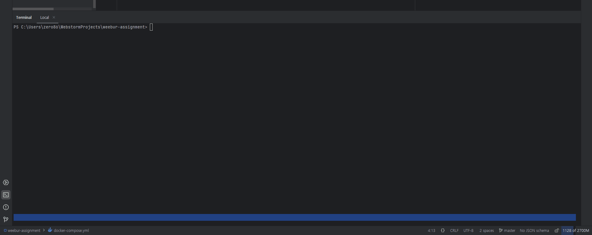

# WEEBUR 프론트엔드 코딩 과제(사전과제)

---

### 기술 요구사항
- Next.js, React.js, TypeScript
- 위 3가지를 제외하고는 자유.

---

### API
- Dummy JSON API Docs 에서 Products API 를 활용.(https://dummyjson.com/docs/products#products-all)

---

### 작업 내역
1. next.js + ts + eslint + tailwindcss 프로젝트 생성(app router 방식 선택)
2. prettier 적용
3. api 타입 정의
4. 상품 가져오기 구현(view, grid 방식)
5. View 표시 방식 구현(쿠키 사용)
6. 검색폼 UI 구현 및 기능 구현
7. 무한 스크롤링 구현(react-query 사용) + useIntersectionObserver.ts, useSearchProducts.ts 커스텀 훅 작성
8. 테스트 및 컴포넌트 작성 및 수정
9. 도커 적용
10. 중복되는 api 코드 모듈화
11. useInfiniteQuery 에러 핸들링 코드 추가

- 미들웨어에서, 쿠키가 없다면 api/set-cookie 로 리다이렉션 처리를 하고 거기서 리다이렉션을 하는 응답을 생성하면서 쿠키를 함께 생성합니다. 50% 확률로 View 출력 방식을 선택해야하므로 Math.random() * 2 를 하여 0~1 값만 나오도록 처리했습니다.
- 1페이지는 SSR을 사용하여 렌더링 되고, 이후 페이지는 무한 스크롤링으로 처리 했습니다.
- 폼 처리는 serverAction 을 통해 리다이렉션을 통하여 재요청이 되도록 했습니다. 검색이 되면 결과가 다시 1페이지부터 나오기 때문에 이러한 흐름으로 진행했습니다.
- eslint 와 prettier 를 적용하여 코드 품질(안티패턴 피하기 + 일관된 포맷팅)을 높이려고 노력했습니다. 사람은 복잡함을 가지고 있고 각 사람마다 습관과 버릇이 무섭기때문입니다.(나중에 기회가 되면 biome 적용해보고 싶습니다.)
- 스타일링은 tailwindCSS 를 사용했습니다. CSS-in-JS 는 runtime overhead 발생과 runtime 시점에 CSSOM 을 조작하여 스타일을 동적으로 처리하므로 SSR과는 궁합이 맞지않습니다. 그래서 tailwindCSS로 진행했으며 유틸리티한 클래스들을 자유롭게 조합해서 스타일링이 가능하고 SSR에서도 문제없이 동작 + 이름까지 완벽하게 지어져있기때문에 이걸로 선택하여 진행했습니다.
- 배포 준비를 위한 컨테이너 기반의 실행환경을 구성했습니다. Next.js 를 빌드하고 필요한 이미지에 대한 설정을 작성하고 이를 compose 로 묶어서 작성하였습니다.(Next.js 와 nginx 컨테이너를 정의하고 연결) nginx.conf 파일을 별도로 구성하여 리버스 프록시 역할을 하도록 정의했습니다.

```
// 프로젝트 구조

weebur-assignment/
├── configs/
│   └── nginx/
│       └── nginx.conf
├── node_modules/
├── public/
├── src/
│   ├── actions/
│   ├── api/
│   ├── app/
│   ├── components/
│   ├── hooks/
│   ├── types/
│   ├── middleware.ts
│   └── ReactQueryProvider.tsx
├── .dockerignore
├── .gitignore
├── .prettierrc.json
├── docker-compose.yml
├── Dockerfile
├── eslint.config.mjs
├── next.config.ts
├── next-env.d.ts
├── package.json
├── package-lock.json
├── postcss.config.mjs
├── README.md
└── tsconfig.json
```


---

### 실행 방법
- Node.js 설치(최소 버전 18.18.0)
- git clone 후, `npm install` 명령어 실행
- 개발 모드 실행 `npm run dev`
- 실행 후, 경로는 `/` 로 확인(ex: http://localhost:3000)
- (or) 빌드 후(`npm run build`), 프로덕션 모드로 실행(`npm run start`)

---

### 실행 방법(Docker)
- docker 설치
- git clone 후, `docker compose up -d` 영령어 실행
- 실행 후, 경로는 `/` 로 확인(ex: http://localhost)
- 종료를 원하면,  `docker compose down` 명령어 실행

---

### 실행 화면



